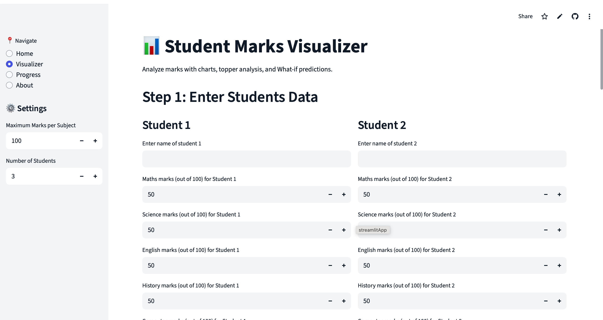

# 📘 MarkSense  

**MarkSense** is a smart student marks visualizer and progress tracker built with **Streamlit** and **Plotly**.  
It helps track daily performance, visualize results, highlight toppers, and make learning fun.  

---

## ✨ Features  
- Enter marks for multiple students and subjects  
- Automatic totals, averages, and ranks  
- Topper highlights 🏆  
- Interactive charts (Bar, Line, Radar)  
- What-if analysis to simulate outcomes  
- Save daily results & track progress over time  
- Export results as CSV  
- Clean light theme 🎨  

---

## 📸 Screenshots  

### Home Page  


### Visualizer  


### Progress Tracker  
 

---

## 🚀 Installation  

Clone the repo and install dependencies:  
```bash
git clone https://github.com/Manavgupta12/Marksense.git
cd marksense
pip install -r requirements.txt
streamlit run app.py
```

---

## 🤝 Contributing  

Pull requests are welcome! If you’d like to suggest new features (like per-student progress trends), open an issue.  

---

## 📜 License  

This project is licensed under the **MIT License**.  


