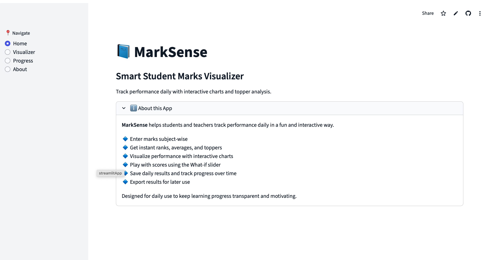
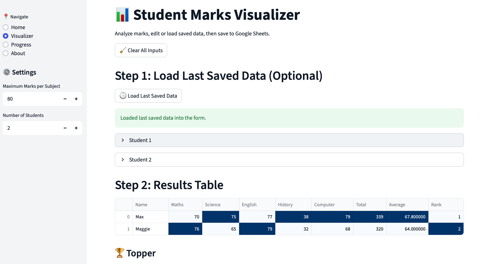
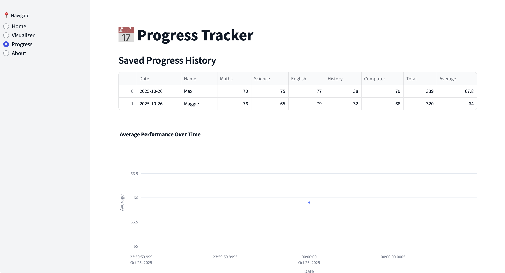

# 📘 MarkSense  

**MarkSense** is a smart student marks visualizer and progress tracker built with **Streamlit**, **Plotly**, and **Google Sheets**.  
It helps track daily performance, visualize results, highlight toppers, and make learning fun with interactive dashboards.  

---

## ✨ Features  

### 🏠 Interactive Home Dashboard
- **Date Selector** - View data from any saved date
- **Top 3 Leaderboard** - Gold, silver, bronze medalists with rankings
- **Class Statistics** - Average, highest/lowest scores, student count
- **Search & Compare** - Compare up to 5 students side-by-side
- **Performance Distribution** - Histograms showing mark patterns
- **Student Spotlight** - Choose random, top performer, or specific student
- **Subject Performance Charts** - Toggle between Bar/Line with class average overlay

### 📊 Visualizer
- Enter marks for multiple students and subjects  
- Automatic totals, averages, and ranks  
- Topper highlights 🏆  
- Interactive charts (Bar, Line, Radar)  
- Insights on weak subjects
- Load last saved data
- Clear all inputs with one click
- Export results as CSV  

### 📅 Progress Tracker
- Track class average performance over time
- Monitor topper's progress
- Individual student progress tracking
- View complete history from Google Sheets

### 🔗 Google Sheets Integration
- **Cloud Storage** - All data saved to Google Sheets
- **Real-time Sync** - Access data from anywhere
- **Complete Data** - Saves Date, Name, Subjects, Total, Average, and Rank
- **No Local Files** - No CSV clutter, everything in the cloud

---

## 📸 Screenshots  

### Home Dashboard  


### Visualizer


### Progress Tracker  
 

---

## 🚀 Installation  

### 1. Clone the Repository
```bash
git clone https://github.com/Manavgupta12/Marksense.git
cd Marksense
```

### 2. Install Dependencies
```bash
pip install -r requirements.txt
```

### 3. Set Up Google Sheets (Required)

#### Step 1: Create a Google Cloud Project
1. Go to [Google Cloud Console](https://console.cloud.google.com/)
2. Create a new project
3. Enable **Google Sheets API** and **Google Drive API**

#### Step 2: Create Service Account
1. Go to **IAM & Admin** > **Service Accounts**
2. Create a new service account
3. Download the JSON key file
4. Rename it to `service_account.json`
5. Place it in the project root directory

#### Step 3: Create Your Google Sheet
1. Create a new Google Sheet named **"MarkSenseHistory"**
2. Add these column headers in the first row:
   ```
   Date | Name | Maths | Science | English | History | Computer | Total | Average | Rank
   ```
3. Share the sheet with the service account email (found in `service_account.json` under `client_email`)
4. Give it **Editor** permissions

### 4. Run the App
```bash
streamlit run app.py
```

---

## 📋 Requirements

- Python 3.8+
- Streamlit 1.28.0+
- Pandas 2.1.0+
- Plotly 5.17.0+
- gspread 5.11.3+
- oauth2client 4.1.3+

---

## 🎯 How to Use

1. **Home Page** - View interactive dashboard with all insights
2. **Visualizer** - Enter student marks and save to Google Sheets
3. **Progress** - Track performance trends over time
4. **About** - Learn more about MarkSense features

### Tips:
- Use the **Date Selector** on Home to view historical data
- **Compare students** by selecting multiple names
- **Load Last Saved Data** in Visualizer to edit previous entries
- All data persists in Google Sheets - no need to worry about losing data!

---

## 🛠️ Configuration

You can customize the app by modifying these variables in `app.py`:

```python
GSHEET_NAME = "MarkSenseHistory"  # Your Google Sheet name
SERVICE_ACCOUNT_FILE = "service_account.json"  # Service account file path
subjects = ["Maths", "Science", "English", "History", "Computer"]  # Subject list
```

---

## 🤝 Contributing  

Pull requests are welcome! If you'd like to suggest new features, open an issue.  

### Ideas for Contribution:
- Add more chart types
- Email reports feature
- Multi-class support
- Grade prediction using ML
- Parent dashboard view

---

## 📜 License  

This project is licensed under the **MIT License**.  

---

## 🙏 Acknowledgments

- Built with ❤️ using **Streamlit** and **Plotly**
- Data persistence powered by **Google Sheets API**

---

## 📞 Support

If you encounter any issues:
1. Check that `service_account.json` is in the correct location
2. Verify Google Sheet name matches `GSHEET_NAME`
3. Ensure the service account has Editor access to the sheet
4. Check that both Google Sheets API and Drive API are enabled

For bugs or feature requests, please open an issue on GitHub.

---

**Made by Manav Gupta** 🚀
